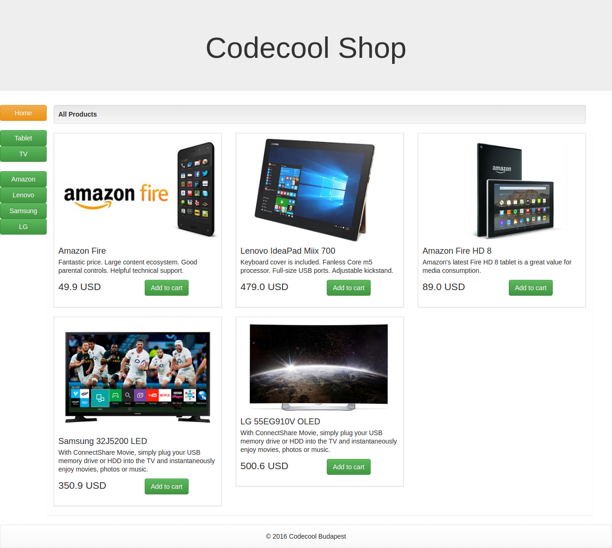

# Codecool Online Shop

The goal was to build an Online Shop, an online eCommerce web-application with Java.
Where users can browse products, add them into a Shopping Cart, checkout items and make payments.

# Preview 

# User Stories

1. Development / Create an environment
2. Products / List
3. Products / by Product Category
4. Products / by Supplier
5. Shopping Cart / add to Cart
6. Shopping Cart / Review
7. Shopping Cart / Edit
8. Shopping Cart / Checkout
9. Shopping Cart / Payment
10. Shopping Cart / Confirmation
11. Admin log

We undertook the first 5 stories and we could accomplish all of them at this week /2016.11.7 - 2016.11.11/.

# Install

1. Import this project to IntelliJ as a Maven project. (IntelliJ can auto-install the dependencies from the pom.xml)
2. `run Main.java`
3. In your browser, type `localhost:8888`

