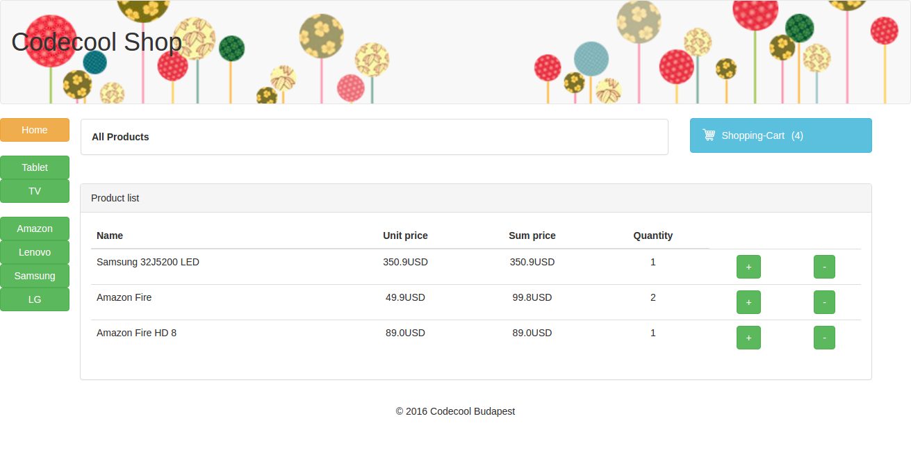

# Codecool Online Shop

The goal was to build an Online Shop, an online eCommerce web-application with Java.
Where users can browse products, add them into a Shopping Cart, checkout items and make payments.

# Preview 

# User Stories

1. Development / Create an environment :white_check_mark:
2. Products / List :white_check_mark:
3. Products / by Product Category :white_check_mark:
4. Products / by Supplier :white_check_mark:
5. Shopping Cart / add to Cart :white_check_mark:
6. Shopping Cart / Review :white_check_mark:
7. Shopping Cart / Edit :white_check_mark:
8. Shopping Cart / Checkout
9. Shopping Cart / Payment
10. Shopping Cart / Confirmation
11. Admin log
12. Products / DB  :white_check_mark:
13. Products / memory DAO testing  :white_check_mark:
14. Product / DB / Testing  :white_check_mark:
15. Database / Config :white_check_mark:
16. Products / List / Unit Test :white_check_mark:
17. Products / by Product Category / Unit test :white_check_mark:
18. Products / by Supplier / Unit test :white_check_mark:
19. Shopping Cart / add to Cart / Unit test
20. Shopping Cart / Review / Unit test
21. Shopping Cart / Edit / Unit test
22. Shopping Cart / Checkout / Unt test
23. Shopping Cart / Payment / Unit test
24. Shopping Cart / Confirmation / Unit test
25. Shopping Cart / Safe Checkout
26. User / Registration
27. User / Login - Logout
28. User / Order history
29. User / Save shopping cart
30. User / Save billing and shipping info
31. Shopping Cart / Safe Checkout / Test
32. User / Registration / Test
33. User / Login - Logout / Test
34. User / Order history / Test
35. User / Save shopping cart / Test
36. User / Save billing and shipping info / Test

We undertook the marked pipe stories and we could accomplish all of them at this week /2016.11.7 - 2016.11.24/.

# Technical requirements

We had to take consideration the following requirements:
- Work with GIT flow.
- Use JDBC for the database access.
- Use the database through the DAO pattern (Data Access Object).
- Suggested (though not required) to cover the new code with tests.
- Use advanced OOP concepts:
- Use inheritance
- Write at least one Abstract class
- Implement at least one Interface
- It's not required to integrate real payment services 

# Install & Usage the App

1. Import this project to IntelliJ as a Maven project. (IntelliJ can auto-install the dependencies from the pom.xml)
2. Fill resources/connection/connection.properties config file with your database's properties
3. `run Main.java`
4. In your browser, type `localhost:8888`

#  Usage the Test

In test/java/com/codecool/shop there are two different folders. 
You can just simply `run JunitTestRunner`

